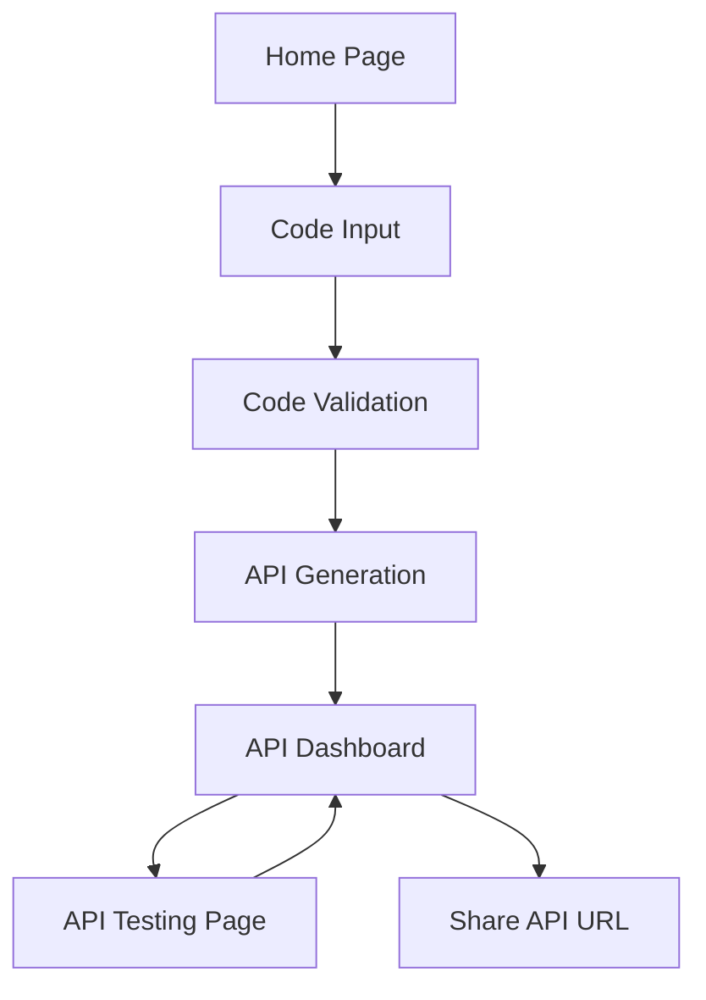

# CodeAPI Generator - Product Requirements Document

## 1. Product Overview
CodeAPI Generator is a web application that transforms Python code snippets into accessible REST APIs, enabling developers to quickly deploy and share their algorithmic solutions.
- Solves the problem of sharing code solutions by converting them into callable APIs that others can use with their own inputs.
- Target users are competitive programmers, algorithm enthusiasts, and developers who want to share code functionality without complex deployment processes.
- Provides instant API deployment with minimal technical overhead, making code sharing as simple as copy-paste.

## 2. Core Features

### 2.1 User Roles
No user role distinction is necessary for the MVP - all users have the same capabilities.

### 2.2 Feature Module
Our CodeAPI Generator consists of the following main pages:
1. **Home page**: hero section with product introduction, code input form, API generation interface.
2. **API Dashboard**: generated API details, endpoint URL display, JSON schema viewer, testing interface.
3. **API Testing page**: interactive API testing tool, request/response viewer, example usage generator.

### 2.3 Page Details

| Page Name | Module Name | Feature description |
|-----------|-------------|---------------------|
| Home page | Hero section | Display product introduction, value proposition, and quick start guide |
| Home page | Code input form | Accept Python code snippets with syntax highlighting and validation |
| Home page | Code validation | Validate Python code has input parameters and return/print statements |
| Home page | API generation | Generate unique API endpoints with random IDs and create JSON schemas |
| API Dashboard | API details display | Show generated API URL, unique ID, and creation timestamp |
| API Dashboard | JSON schema viewer | Display input payload schema with data types and parameter descriptions |
| API Dashboard | Code preview | Show the original Python code with syntax highlighting |
| API Dashboard | Usage examples | Generate code examples in multiple languages (curl, JavaScript, Python) |
| API Testing page | Request builder | Interactive form to build API requests with parameter inputs |
| API Testing page | Response viewer | Display API responses with JSON formatting and error handling |
| API Testing page | Test history | Store and display previous test requests and responses |

## 3. Core Process

**Main User Flow:**
1. User visits the home page and sees the code input interface
2. User pastes or writes Python code snippet in the input form
3. System validates the code has proper input parameters and return statements
4. User clicks "Generate API" button
5. System creates unique API endpoint with random ID
6. User is redirected to API Dashboard showing the generated API details
7. User can test the API using the testing interface
8. User shares the API URL with others for consumption

## 4. User Interface Design

### 4.1 Design Style
- Primary colors: Deep blue (#1e40af) and bright green (#10b981)
- Secondary colors: Light gray (#f8fafc) and dark gray (#374151)
- Button style: Rounded corners with subtle shadows and hover effects
- Font: Inter or system fonts, 16px base size, 14px for secondary text
- Layout style: Clean, minimal design with card-based components and centered content
- Icon style: Outline icons from Heroicons or similar, consistent 24px size

### 4.2 Page Design Overview

| Page Name | Module Name | UI Elements |
|-----------|-------------|-------------|
| Home page | Hero section | Large heading, subtitle, gradient background, call-to-action button |
| Home page | Code input form | Monaco editor with Python syntax highlighting, dark theme, line numbers |
| Home page | API generation | Primary button with loading state, progress indicator, success animation |
| API Dashboard | API details display | Card layout with copy-to-clipboard buttons, status indicators, monospace fonts for URLs |
| API Dashboard | JSON schema viewer | Collapsible tree view, syntax highlighting, type badges for parameters |
| API Testing page | Request builder | Form inputs with validation, parameter type indicators, example values |
| API Testing page | Response viewer | JSON formatter with collapsible sections, status code indicators, timing information |

### 4.3 Responsiveness
Desktop-first design with mobile-adaptive layout. Touch interaction optimization for mobile devices, including larger touch targets and swipe gestures for navigation.