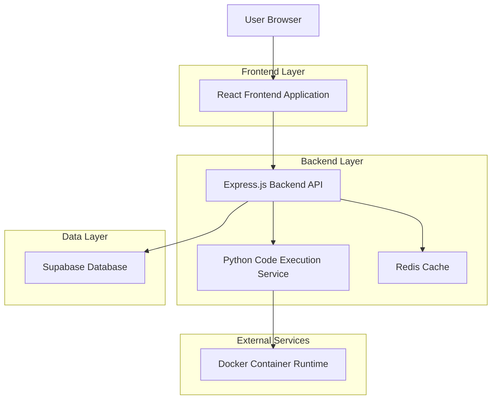
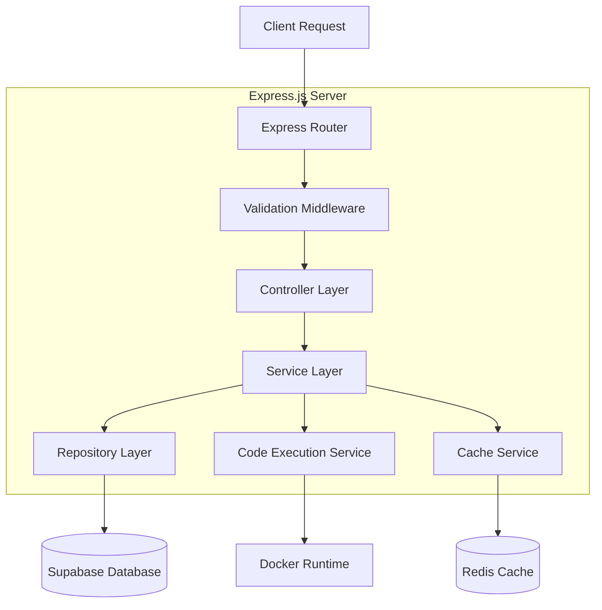
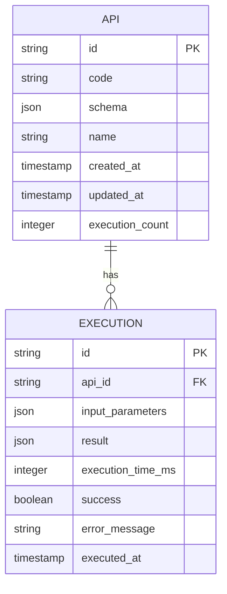

# CodeAPI Generator - Technical Architecture Document

## 1. Architecture Design



## 2. Technology Description

* Frontend: React\@18 + TypeScript + Tailwind CSS + Vite + Monaco Editor

* Backend: Express.js\@4 + TypeScript + Node.js

* Database: Supabase (PostgreSQL)

* Cache: Redis

* Code Execution: Docker containers with Python runtime

* Package Management: pnpm (frontend), npm (backend)

## 3. Route Definitions

| Route        | Purpose                                                           |
| ------------ | ----------------------------------------------------------------- |
| /            | Home page with code input interface and API generation            |
| /api/:apiId  | API Dashboard showing generated API details and testing interface |
| /test/:apiId | Dedicated API testing page with advanced testing tools            |
| /docs        | API documentation and usage examples                              |

## 4. API Definitions

### 4.1 Core API

**Code Validation and API Generation**

```
POST /api/generate
```

Request:

| Param Name | Param Type | isRequired | Description                                |
| ---------- | ---------- | ---------- | ------------------------------------------ |
| code       | string     | true       | Python code snippet to be converted to API |
| apiName    | string     | false      | Custom name for the API (optional)         |

Response:

| Param Name | Param Type | Description                             |
| ---------- | ---------- | --------------------------------------- |
| success    | boolean    | Whether API generation was successful   |
| apiId      | string     | Unique identifier for the generated API |
| apiUrl     | string     | Full URL to access the generated API    |
| schema     | object     | JSON schema for API input parameters    |
| errors     | string\[]  | Validation errors if any                |

Example Request:

```json
{
  "code": "def solve(n, k):\n    return n + k",
  "apiName": "simple_addition"
}
```

Example Response:

```json
{
  "success": true,
  "apiId": "abc123def456",
  "apiUrl": "https://api.codeapi.dev/exec/simple_addition/abc123def456",
  "schema": {
    "type": "object",
    "properties": {
      "n": {"type": "number"},
      "k": {"type": "number"}
    },
    "required": ["n", "k"]
  },
  "errors": []
}
```

**API Execution**

```
POST /api/exec/:apiId
```

Request:

| Param Name | Param Type | isRequired | Description                              |
| ---------- | ---------- | ---------- | ---------------------------------------- |
| parameters | object     | true       | Input parameters matching the API schema |

Response:

| Param Name    | Param Type | Description                           |
| ------------- | ---------- | ------------------------------------- |
| success       | boolean    | Whether execution was successful      |
| result        | any        | Output from the Python code execution |
| executionTime | number     | Execution time in milliseconds        |
| error         | string     | Error message if execution failed     |

**API Details Retrieval**

```
GET /api/details/:apiId
```

Response:

| Param Name     | Param Type | Description                         |
| -------------- | ---------- | ----------------------------------- |
| apiId          | string     | Unique API identifier               |
| code           | string     | Original Python code                |
| schema         | object     | Input parameter schema              |
| createdAt      | string     | API creation timestamp              |
| executionCount | number     | Number of times API has been called |

## 5. Server Architecture Diagram



## 6. Data Model

### 6.1 Data Model Definition



### 6.2 Data Definition Language

**API Table (apis)**

```sql
-- Create APIs table
CREATE TABLE apis (
    id VARCHAR(12) PRIMARY KEY,
    code TEXT NOT NULL,
    schema JSONB NOT NULL,
    name VARCHAR(100),
    created_at TIMESTAMP WITH TIME ZONE DEFAULT NOW(),
    updated_at TIMESTAMP WITH TIME ZONE DEFAULT NOW(),
    execution_count INTEGER DEFAULT 0
);

-- Create indexes
CREATE INDEX idx_apis_created_at ON apis(created_at DESC);
CREATE INDEX idx_apis_execution_count ON apis(execution_count DESC);

-- Grant permissions
GRANT SELECT ON apis TO anon;
GRANT ALL PRIVILEGES ON apis TO authenticated;
```

**Execution History Table (executions)**

```sql
-- Create executions table
CREATE TABLE executions (
    id UUID PRIMARY KEY DEFAULT gen_random_uuid(),
    api_id VARCHAR(12) REFERENCES apis(id) ON DELETE CASCADE,
    input_parameters JSONB NOT NULL,
    result JSONB,
    execution_time_ms INTEGER,
    success BOOLEAN DEFAULT false,
    error_message TEXT,
    executed_at TIMESTAMP WITH TIME ZONE DEFAULT NOW()
);

-- Create indexes
CREATE INDEX idx_executions_api_id ON executions(api_id);
CREATE INDEX idx_executions_executed_at ON executions(executed_at DESC);
CREATE INDEX idx_executions_success ON executions(success);

-- Grant permissions
GRANT SELECT ON executions TO anon;
GRANT ALL PRIVILEGES ON executions TO authenticated;
```

**Initial Data**

```sql
-- Insert sample API for testing
INSERT INTO apis (id, code, schema, name) VALUES (
    'sample123',
    'def solve(a, b):\n    return a + b',
    '{"type": "object", "properties": {"a": {"type": "number"}, "b": {"type": "number"}}, "required": ["a", "b"]}',
    'Simple Addition'
);
```

